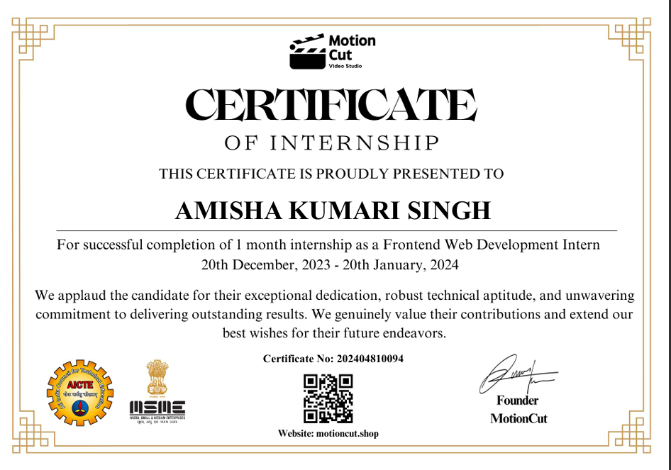

# 💻 Frontend Internship Projects 
## Company Name – MotionCut
This repository contains the tasks completed during my **Frontend Internship at MotionCut**, showcasing responsive design, dynamic behavior, and creative UI using **HTML**, **CSS**, and **JavaScript**.

---

## 📋 Tasks Overview

### 🧾 Task 1 – Pricing Landing Page
- Designed a responsive pricing page layout
- Included pricing structure, currency & unit customization
- Added interactive elements using JavaScript
- Built with proficiency in **HTML**, **CSS**, and **JS**

---

### 🔐 Task 2 – Creative Login Page
- Developed a modern login portal using only **HTML & CSS**
- Focused on layout creativity and clean design
- No JavaScript used as per the guidelines

---

### 🎂 Task 3 – Dynamic Cake Shop Homepage
- Built a responsive homepage for a cake-selling website
- Integrated design components to reflect brand aesthetics
- Added dynamic content for a realistic user experience

---

### ✅ Task 4 – To-Do List App
- Create, manage, edit, and delete tasks
- ✅ Mark tasks as completed  
- ♻️ Update and delete tasks  
- 📱 Fully responsive UI for all devices  
- Developed using **HTML, CSS, and JavaScript**

---

🎓 This internship helped strengthen my frontend fundamentals and UI/UX skills through hands-on, practical challenges.

## Internship Certificate

